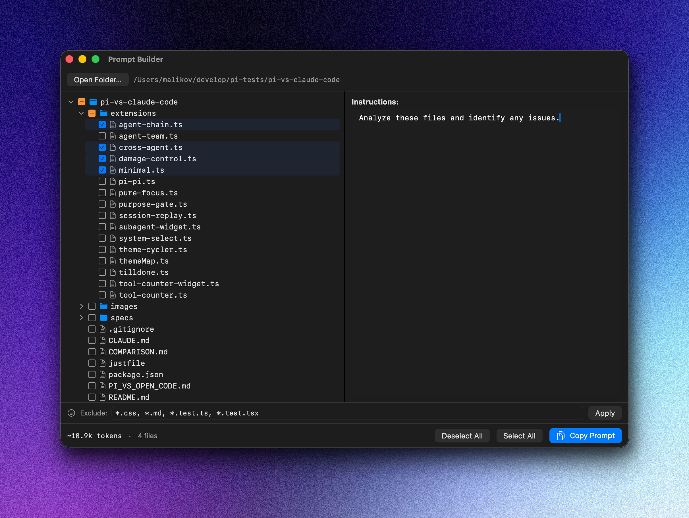

# Prompt Builder

A native macOS app for assembling LLM context prompts from your codebase. Select files from a project tree, add instructions, and copy the complete prompt to clipboard — ready to paste into ChatGPT, Claude, or any other LLM.

**Free and open-source alternative to [RepoPrompt](https://repoprompt.com/).**



## Features

- **Native macOS app** — built with SwiftUI, single binary (~380KB), no Electron, no runtime dependencies
- **Project file tree** with recursive folder selection and tri-state checkboxes (checked / unchecked / partial)
- **Smart file filtering** — automatically skips `node_modules`, `.git`, binary files, and respects `.gitignore`
- **Exclude patterns** — filter out files by glob masks (e.g. `*.css, *.md, *.test.ts`)
- **Live token counter** — estimates token count as you select files
- **One-click copy** — builds the prompt and copies to clipboard in one action
- **Structured output** — generates `<file_map>`, `<file_contents>`, and `<user_instructions>` XML sections

## Output Format

The generated prompt has three XML sections:

**`<file_map>`** — ASCII tree of the project with `*` marking selected files:

    /path/to/project
    ├── src
    │   ├── api
    │   │   └── client.ts *
    │   └── main.tsx *
    └── package.json

**`<file_contents>`** — full source code of each selected file, wrapped in fenced code blocks with language detection.

**`<user_instructions>`** — your custom instructions/prompt.

## Install

### Download

Grab the latest `PromptBuilder.dmg` from [Releases](https://github.com/alexrett/prompt-builder/releases).

Signed and notarized with Apple Developer ID — no Gatekeeper warnings.

### Build from Source

Requires Xcode Command Line Tools and macOS 13+.

```bash
git clone https://github.com/alexrett/prompt-builder.git
cd prompt-builder
swift build -c release
open .build/release/PromptBuilder
```

To build a universal binary (Intel + Apple Silicon):

```bash
swift build -c release --arch arm64 --arch x86_64
```

### Create .app Bundle

```bash
# Build
swift build -c release --arch arm64 --arch x86_64

# Create bundle
mkdir -p PromptBuilder.app/Contents/MacOS PromptBuilder.app/Contents/Resources
cp .build/apple/Products/Release/PromptBuilder PromptBuilder.app/Contents/MacOS/
cp AppIcon.icns PromptBuilder.app/Contents/Resources/

cat > PromptBuilder.app/Contents/Info.plist << 'EOF'
<?xml version="1.0" encoding="UTF-8"?>
<!DOCTYPE plist PUBLIC "-//Apple//DTD PLIST 1.0//EN" "http://www.apple.com/DTDs/PropertyList-1.0.dtd">
<plist version="1.0">
<dict>
    <key>CFBundleExecutable</key>
    <string>PromptBuilder</string>
    <key>CFBundleIdentifier</key>
    <string>com.whitehappypony.prompt-builder</string>
    <key>CFBundleName</key>
    <string>Prompt Builder</string>
    <key>CFBundlePackageType</key>
    <string>APPL</string>
    <key>CFBundleShortVersionString</key>
    <string>1.0</string>
    <key>CFBundleIconFile</key>
    <string>AppIcon</string>
    <key>LSMinimumSystemVersion</key>
    <string>13.0</string>
    <key>NSHighResolutionCapable</key>
    <true/>
</dict>
</plist>
EOF
```

## Usage

1. **Open Folder** (⌘O) — select your project directory
2. **Select files** — click folders to select recursively, click individual files to toggle
3. **Exclude patterns** — type glob masks like `*.css, *.md, *.test.ts` and press Apply
4. **Add instructions** — write your prompt in the Instructions panel
5. **Copy Prompt** (⌘⇧C) — builds and copies the complete prompt to clipboard

You can also pass a project path as a CLI argument:

```bash
./PromptBuilder /path/to/your/project
```

## Keyboard Shortcuts

| Shortcut | Action |
|----------|--------|
| ⌘O | Open folder |
| ⌘⇧C | Build & copy prompt |

## Requirements

- macOS 13.0 (Ventura) or later
- Works on both Apple Silicon and Intel Macs

## License

MIT
